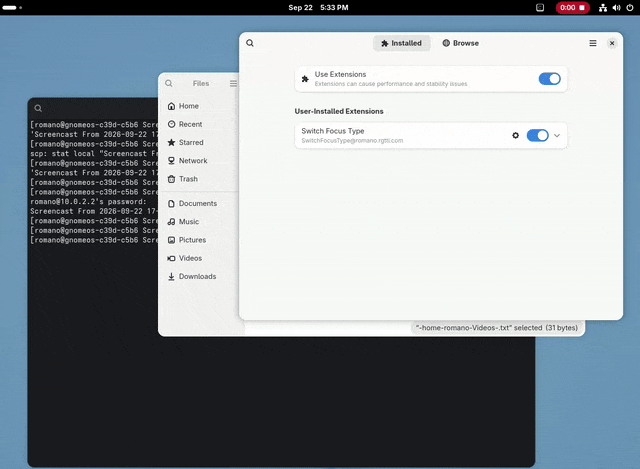

# Switch Focus Type gnome-shell extension

By Romano Giannetti <romano@rgtti.com> , <romano.giannetti@gmail.com>

You are on the `master` branch (Gnome Shell version ≥ 50).

### Notice and disclaimer

If you don't know what [Focus-Follow-Mouse
(FFM)](https://en.wikipedia.org/wiki/Focus_\(computing\)#Focus_follows_pointer)
is, or you don't like it, this extension is not for you.

### Rationale

This extension is oriented to user that likes to have their focus mode set to
"sloppy" (an enhanced focus-follow-mouse mode, FFM), or "mouse", but sometimes
they need to switch to the click-to-focus (CTF) mode because some program
misbehave: for example, a lot of programs running under `wine` will fail to
correctly show menus when in Focus Follow Mouse (the menu disappears shortly
after popping up because the window which is the menu is unable to get focus).
The extension preferences let you select the `sloppy` or `mouse` FFM variant,
enable Auto-raise, and choose its delay. Auto-raise uses GNOME's native window
manager settings, so the same values remain visible in Tweaks and dconf-editor.

### Features

Click on the icon to change from FFM (_F_ icon) to CTF (_C_ icon). Each click
toggle the status.

There are four main branches:

- `legacy`: GNOME Shell 3.10–3.36
- `legacy2`: GNOME Shell 3.38–44
- `legacy3`: GNOME Shell 45–49
- `master`: GNOME Shell 50 and later

The exact supported Shell versions are declared in each released extension's
`metadata.json`. The options for activating or not the notifications or for
choosing between `sloppy` and `mouse` mode are available only from gnome 45
(version 13).

If you want to test it on another version, just try to add the version to
`metadata.json` and tell me if it works for you.

### Install

The preferred way to install this extension from [the Gnome extensions
site](https://extensions.gnome.org/); the correct version will be used
automatically. Notice that extensions are reviewed and vetted on that site
(which is *good*), so not always the most recent version is available there.
Just wait a bit...

If you want to install from source, just copy/link the directory
`SwitchFocusType@romano.rgtti.com` to your
`~/.local/share/gnome-shell/extensions/`, restart the shell (on Wayland,
login/logout), enable it with `gnome-tweak-tool` or [Extension
Manager](https://flathub.org/en/apps/com.mattjakeman.ExtensionManager) or
something equivalent. If you clone the repository, remember to check out the
correct branch with `git checkout master` or the correct legacy version with
`git checkout legacy...` depending on the version of your shell.

When clicked, by default it switches between "sloppy" and "click" focus modes,
and it notifies every change; the behavior is adjustable with the options (you
can access them with your extension manager of choice).

The panel button changes GNOME's native `focus-mode` setting. In the newest
(but not the legacy) version the preferences window also exposes the native
`auto-raise` and `auto-raise-delay` settings; their values are preserved while
Click-to-focus is active and take effect when GNOME is using either FFM mode.

### Acknowledgments

Icons based on LockKeys extension by Kazimieras Vaina *et al.* at
https://extensions.gnome.org/extension/36/lock-keys/ .

The reviews by
[JustPerfection](https://extensions.gnome.org/accounts/profile/JustPerfection)
have always been valuable teaching points.

